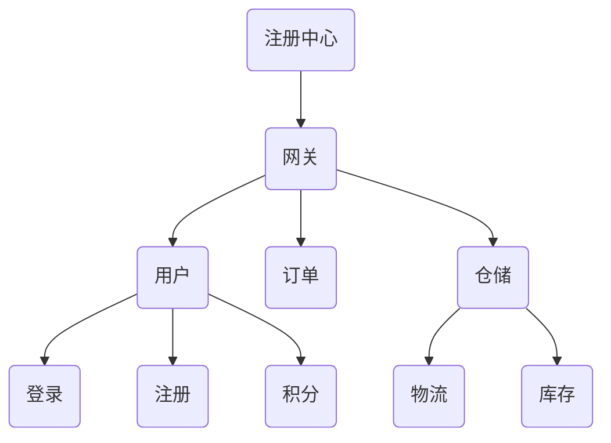

---
## 项目架构【下图可用 Typora 查看】


## 流程图【下图可用 Typora 查看】
```flow
begin=>start: 用户进入
account=>condition: 有账号?
register=>operation: 注册
login=>operation: 登录
see=>subroutine: 商品的查看与选购
commit=>operation: 提交订单
pay=>condition: 两小时内支付?
enter_info=>operation: 确认收货地址(选填)
warehouse=>operation: 仓储/物流
cancle=>operation: 订单取消
return=>condition: 退换货?
change=>operation: 寄回(换货再寄出)
enter=>operation: 确认收货/评价/售后
end=>end: 结束
begin->account
account(yes)->login->see
account(no)->register->see
see->commit->pay
pay(yes)->enter_info->warehouse->return
pay(no)->cancle->end
return(no)->enter->end
return(yes)->change->warehouse
```

